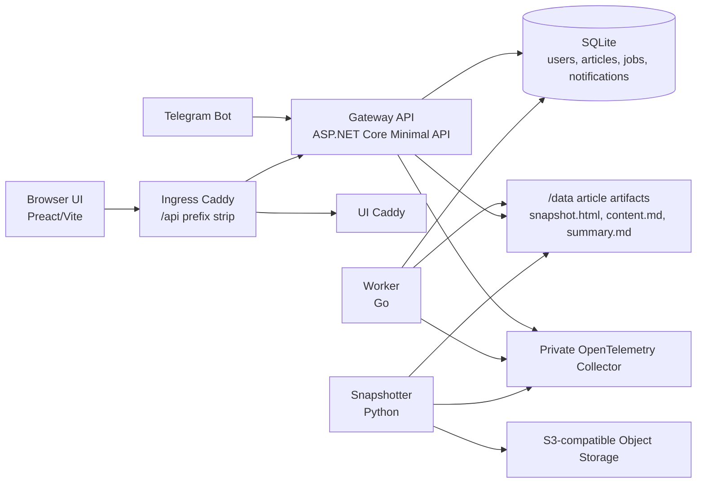
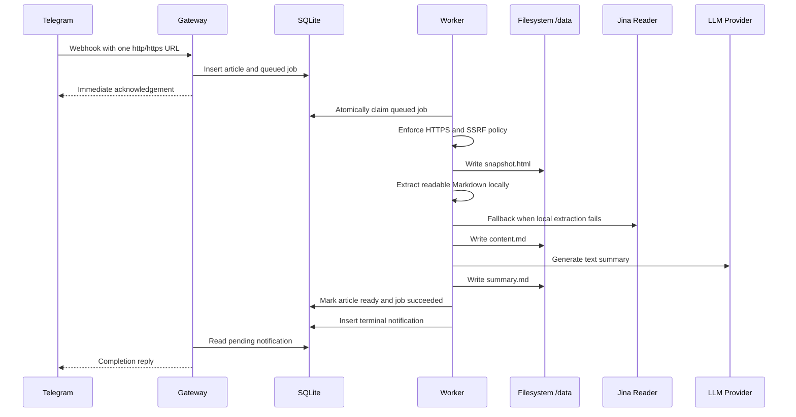
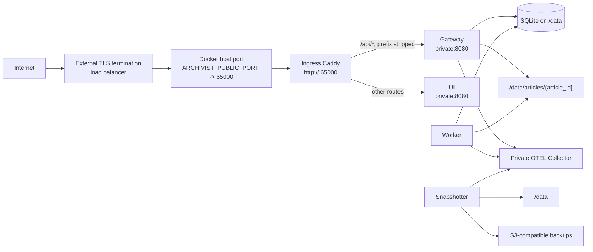

# Archivist

> Send Archivist a web page link through Telegram, and Archivist will snapshot and summarize it.

## Architecture

This section is an orientation layer. The canonical rebuild contracts remain [`docs/ARCHITECTURE.md`](docs/ARCHITECTURE.md), [`docs/DESIGN.md`](docs/DESIGN.md), [`docs/ARTIFACTS.md`](docs/ARTIFACTS.md), [`docs/ERRORS.md`](docs/ERRORS.md), and the feature specs under [`docs/specs/`](docs/specs/).

Archivist is a small personal article archiving system. Telegram is the ingestion channel, Gateway owns HTTP/API/auth/Telegram boundaries, Worker owns article processing, SQLite owns durable state, the filesystem owns article artifacts, Snapshotter backs up `/data`, and the UI reads only through Gateway.



Article ingestion and processing are asynchronous. Gateway accepts a Telegram URL, persists article and job state, and sends the immediate Telegram reply. Worker claims queued jobs from SQLite, enforces the HTTPS-only article fetch and SSRF boundary, writes artifacts, persists terminal state, and creates terminal notification rows. Gateway later dispatches Telegram completion replies from those rows.



Production deployment keeps Gateway private on the Docker network. Only ingress Caddy publishes the application port, strips `/api` before forwarding to Gateway, and overwrites forwarded headers so Gateway evaluates auth and host checks from the trusted public context.



## Design Decisions

The durable decisions are recorded in [`docs/DESIGN.md`](docs/DESIGN.md). The decisions most likely to surprise a reader are:

- SQLite is the authoritative state store, while `/data/articles/{article_id}/` stores retained and derived artifacts.
- Gateway and Worker communicate through SQLite, not RPC.
- Worker is single-instance in v0; jobs and Telegram notifications do not retry automatically.
- Worker is the article website security boundary: Gateway may accept `http` or `https` URLs, but Worker processing fetches direct HTTPS only and applies SSRF protections.
- Gateway owns all Telegram API calls. Worker records terminal notification intent in SQLite.
- Article success is final only after `summary.md` is atomically written and article/job/notification state commits.
- Summaries are text-only Markdown in v0. `summary.json` remains a future structured-summary artifact.
- Authentication uses a password-only login and an opaque server-side session id cookie; the cookie contains no user payload.
- Runtime ownership is user-aware, but v0 still has one bootstrapped personal account. Worker CLI enqueue is the explicit default-user exception.
- Stale running jobs are operator-recoverable through explicit authenticated force delete after two hours; normal delete still rejects running jobs.
- Snapshotter backups are simple object-storage archives: SQLite is copied through the online backup API, while non-database artifacts are copied best-effort from a live filesystem.
- Gateway hard delete accepts a documented SQLite/filesystem atomicity limit because SQLite transactions cannot include artifact directory deletion.
- OpenTelemetry is always configured in Compose through a private Collector. Collector outages must not stop core Gateway, Worker, or Snapshotter behavior.

## Launch locally

Archivist runs locally as four processes: the ASP.NET Core Gateway API, the Go Worker, the Vite UI, and the Python Snapshotter.

Create a local data directory and export the shared configuration before starting the processes:

```bash
mkdir -p .local/data

export ARCHIVIST_SQLITE_PATH="$PWD/.local/data/archive.db"
export ARCHIVIST_DATA_DIR="$PWD/.local/data"
export ARCHIVIST_AUTH_BOOTSTRAP_PASSWORD="<2048 printable ASCII characters>"
```

The Worker also requires the extraction and summary provider configuration:

```bash
export ARCHIVIST_JINA_API_KEY="<jina-api-key>"
export ARCHIVIST_LLM_PROVIDER="anthropic"
export ARCHIVIST_LLM_API_KEY="<anthropic-api-key>"
export ARCHIVIST_LLM_MODEL="claude-haiku-4-5-20251001"
```

The Snapshotter also requires S3-compatible Object Storage configuration:

```bash
export ARCHIVIST_SNAPSHOTTER_INTERVAL_SECONDS="86400"
export ARCHIVIST_SNAPSHOTTER_WORK_DIR="/tmp/archivist-snapshotter"
export ARCHIVIST_SNAPSHOTTER_S3_ENDPOINT_URL="<s3-endpoint-url>"
export ARCHIVIST_SNAPSHOTTER_S3_REGION="<s3-region>"
export ARCHIVIST_SNAPSHOTTER_S3_BUCKET="<bucket>"
export ARCHIVIST_SNAPSHOTTER_S3_ACCESS_KEY_ID="<access-key-id>"
export ARCHIVIST_SNAPSHOTTER_S3_SECRET_ACCESS_KEY="<secret-access-key>"
export ARCHIVIST_SNAPSHOTTER_OBJECT_PREFIX=""
```

Set Telegram configuration only when testing webhook ingestion:

```bash
export ARCHIVIST_Telegram__BotToken="<telegram-bot-token>"
export ARCHIVIST_Telegram__WebhookSecret="<telegram-webhook-secret>"
```

Start the Gateway API in one terminal:

```bash
cd src/gateway
dotnet run --project Archivist.Gateway.Api
```

Smoke-check the Gateway:

```bash
curl http://localhost:5178/ping/
```

Start the Worker in a second terminal:

```bash
cd src/worker
go run ./cmd/app process
```

Start the UI in a third terminal:

```bash
cd src/ui
npm install
npm run dev
```

Start the Snapshotter in a fourth terminal after the Python project has been bootstrapped:

```bash
cd src/snapshotter
uv sync --locked --all-extras --dev
uv run archivist-snapshotter
```

The standalone Vite dev server does not proxy `/api`. The full authenticated browser flow requires a same-origin HTTPS reverse proxy that strips `/api` before forwarding to Gateway and sends `X-Forwarded-Proto: https`.

Generate a local-only TLS certificate for `localhost`:

```bash
mkdir -p .local/tls

openssl req -x509 -newkey rsa:2048 -sha256 -days 30 -nodes \
  -keyout .local/tls/localhost.key \
  -out .local/tls/localhost.crt \
  -subj "/CN=localhost" \
  -addext "subjectAltName=DNS:localhost,IP:127.0.0.1,IP:0:0:0:0:0:0:0:1"
```

The repository includes `Caddyfile.local` for the local HTTPS ingress:

```caddyfile
https://localhost:8443 {
	tls .local/tls/localhost.crt .local/tls/localhost.key

	handle_path /api/* {
		reverse_proxy localhost:5178 {
			header_up Host localhost:8443
			header_up X-Forwarded-Proto https
			header_up X-Forwarded-Host localhost:8443
			header_up X-Forwarded-For {remote_host}
		}
	}

	handle {
		reverse_proxy 127.0.0.1:5173
	}
}
```

Start the local ingress in another terminal:

```bash
caddy run --config Caddyfile.local
```

Open `https://localhost:8443` and temporarily trust the local certificate when the browser asks. Do not commit `.local/tls/`.

## Docker Compose Deployment

The Compose stack runs Gateway, Worker, UI, Snapshotter, a private OpenTelemetry Collector, and, in development only, Grafana LGTM for manual OTEL validation.

Compose uses a shared base file plus small overlays. `docker-compose.yaml` contains the common service topology. `docker-compose.local.yaml` adds local builds, static local defaults, env-file-backed secrets and external target selectors, and the development-only Grafana LGTM service.

Create `.env.local` from `.env.local.example`, fill the required secrets and external target values, then start the local stack. Static local defaults such as `/data/archive.db`, `/data`, local ports, model defaults, and the local Collector endpoint live in `docker-compose.local.yaml`.

```bash
cp .env.local.example .env.local
docker compose --env-file .env.local -f docker-compose.yaml -f docker-compose.local.yaml up --build
```

Local Compose may call production Telegram, LLM, S3-compatible Object Storage, or OTEL backends if you copy production values into `.env.local`. This is intentional for realistic local validation.

For local OTEL validation, the local Collector exports to the Grafana LGTM container. Grafana is available at `http://localhost:40300`. Login with username `admin` and password `admin`.

Relevant local OTEL variables:

```bash
OTEL_EXPORTER_OTLP_ENDPOINT=http://otelcol:4318

ARCHIVIST_OTEL_COLLECTOR_IMAGE=otel/opentelemetry-collector-contrib:0.153.0
ARCHIVIST_OTEL_EXPORTER_OTLP_ENDPOINT=http://lgtm:4318
ARCHIVIST_OTEL_EXPORTER_OTLP_AUTHORIZATION=
ARCHIVIST_OTEL_TAIL_SAMPLING_PERCENTAGE=10
ARCHIVIST_OTEL_TAIL_SAMPLING_DECISION_WAIT=10s
```

`OTEL_EXPORTER_OTLP_ENDPOINT` is the application SDK endpoint. It points to Archivist's private Collector. `ARCHIVIST_OTEL_EXPORTER_OTLP_ENDPOINT` is the Collector exporter endpoint. In local development it points to Grafana LGTM. Compose does not expose application-side trace/log exporter disable switches; telemetry is always configured.

### Production reverse-proxy security warning

The production Gateway trusts `X-Forwarded-Proto`, `X-Forwarded-Host`, and related forwarded headers because Archivist is designed to run on an operator-controlled VPS where only ingress Caddy publishes the public application port and Gateway is reachable only on the private Docker network. This is intentional for deployments behind load balancers with dynamic source IPs, where static trusted-proxy IP configuration is brittle.

**Do not publish Gateway directly to the Internet.** If Gateway is exposed directly while it trusts forwarded headers, a client can send spoofed forwarded values. What might happen: Gateway could evaluate login HTTPS checks, public host checks, URL generation, or audit context using attacker-supplied scheme/host data instead of the real connection context. Keep only ingress Caddy publicly reachable, keep Gateway private, and make Caddy overwrite forwarded headers before proxying `/api/*`.

## Production OTEL Deployment

Production releases package `docker-compose.yaml`, `docker-compose.prod.yaml`, `.env`, `.env.images`, `rp.Caddyfile`, and `otelcol-config.yaml`. The packaged `.env` is copied from `.env.example` and is the production variable reference. Fill every `<specify>` value before deployment. Production Compose has no default fallbacks: required variables must be set and non-empty, while optional variables listed with empty values may remain empty.

Deploy with the packaged `.env` first and `.env.images` second so release image pins win:

```bash
docker compose --env-file .env --env-file .env.images -f docker-compose.yaml -f docker-compose.prod.yaml up -d
```

The production stack includes the private Archivist Collector but does not include Grafana LGTM. Configure the Collector exporter for your Grafana-compatible OTLP backend:

```bash
ARCHIVIST_OTEL_COLLECTOR_IMAGE=otel/opentelemetry-collector-contrib:0.153.0
ARCHIVIST_OTEL_EXPORTER_OTLP_ENDPOINT=<grafana-compatible-otlp-http-endpoint>
ARCHIVIST_OTEL_EXPORTER_OTLP_AUTHORIZATION=<authorization-header-value>
ARCHIVIST_OTEL_TAIL_SAMPLING_PERCENTAGE=10
ARCHIVIST_OTEL_TAIL_SAMPLING_DECISION_WAIT=10s
```

Keep Collector OTLP receiver ports private on the Docker network. Do not publish `4318` to the host. Only ingress Caddy should publish the public application port.

The Collector tail-samples traces:

- all traces with at least one span status of `ERROR` are retained;
- 10% of non-error traces are retained.

Applications export traces with always-on SDK sampling so the Collector can make the sampling decision after seeing trace outcomes.
Gateway emits selective HTTP failure logs for security-relevant `401`/`403` responses and operational `5xx` responses, while suppressing routine unauthenticated `GET /auth/session` probes and successful request noise.

Collector runtime outages must not stop Gateway, Worker, or Snapshotter core behavior. Standard OTEL exporters may drop telemetry after bounded retries/timeouts while the application continues. Invalid telemetry configuration may still fail startup.

## Manual OTEL Validation

After starting the local Compose stack:

1. Open `http://localhost:40300`.
2. Submit an article through Telegram or enqueue a URL with the Worker CLI.
3. In Grafana, inspect traces for Gateway inbound HTTP spans.
4. Confirm Worker processing continues the Gateway trace for Telegram-created jobs.
5. Confirm Worker CLI-enqueued jobs create traces without requiring a parent.
6. Confirm Snapshotter emits independent snapshot attempt traces.
7. Inspect logs and confirm records inside spans include `trace_id` and `span_id`.
8. Search logs/traces by `article_id`, `job_id`, URL, or provider request ID as attributes.
9. Confirm those high-cardinality values are not Loki labels or metric labels.
10. Stop `otelcol` and confirm core application behavior continues while telemetry export fails non-fatally.
