# MASTERPLAN.md

## Purpose

This file is a derived implementation navigation artifact for rebuilding Archivist from the canonical documents under `docs/`.

It is not listed in `docs/REBUILD.md` and is not authoritative by itself. If this file conflicts with `docs/specs/INDEX.md`, a feature `PLAN.md`, a task file, or an ExecPlan, the canonical feature artifacts win and this file must be regenerated.

## Sources

- [`docs/specs/INDEX.md`](./specs/INDEX.md)
- Feature plans under `docs/specs/*/PLAN.md`
- Task frontmatter under `docs/specs/*/tasks/*.md`
- ExecPlan status frontmatter under `docs/specs/*/plans/*.execplan.md`

## Execution Rules

- Each wave groups tasks whose declared dependencies are already satisfied by earlier waves.
- Same-wave tasks are parallel-safe only when agents keep to each task's documented ownership boundaries.
- If same-wave tasks need to edit the same schema, route registration, repository interface, worker pipeline, shared fixture, or top-level UI shell, sequence those tasks explicitly.
- Tasks with proposed ExecPlans must have those ExecPlans accepted or updated before execution when they become ready.
- Skipped tasks remain in the DAG for dependency completeness but are not implementation work.

## Implementation Waves

### Wave 0 - Completed Planning And Standards

- [`AUTHN-001`](./specs/authn/tasks/AUTHN-001-authn-canonical-docs-and-design-decisions.md) - Authn canonical docs and design decisions. Feature: [`authn`](./specs/authn/SPEC.md). Status: `done`.
- [`ARTPROC-001`](./specs/article-processing/tasks/ARTPROC-001-create-feature-spec-and-plan-artifacts.md) - Create feature spec and plan artifacts. Feature: [`article-processing`](./specs/article-processing/SPEC.md). Status: `done`.
- [`ARTPROC-002`](./specs/article-processing/tasks/ARTPROC-002-define-shared-arc-error-code-convention.md) - Define shared ARC error-code convention. Feature: [`article-processing`](./specs/article-processing/SPEC.md). Status: `done`.
- [`MDEXT-001`](./specs/markdown-extraction/tasks/MDEXT-001-create-feature-artifacts-and-contracts.md) - Create feature artifacts and contracts. Feature: [`markdown-extraction`](./specs/markdown-extraction/SPEC.md). Status: `done`.
- [`SUMGEN-001`](./specs/summary-generation/tasks/SUMGEN-001-create-feature-artifacts-and-contracts.md) - Create feature artifacts and contracts. Feature: [`summary-generation`](./specs/summary-generation/SPEC.md). Status: `done`.
- [`UIEND-001`](./specs/ui-endpoints/tasks/UIEND-001-create-canonical-artifacts.md) - Create canonical artifacts. Feature: [`ui-endpoints`](./specs/ui-endpoints/SPEC.md). Status: `done`.
- [`UI-001`](./specs/ui/tasks/UI-001-create-canonical-ui-artifacts.md) - Create canonical UI artifacts. Feature: [`ui`](./specs/ui/SPEC.md). Status: `done`.

### Wave 1 - Current Ready Parallel Foundations

- [`TELING-001`](./specs/telegram-ingestion/tasks/TELING-001-persistence-contracts.md) - Persistence contracts. Feature: [`telegram-ingestion`](./specs/telegram-ingestion/SPEC.md). Status: `ready`. ExecPlan: [`accepted`](./specs/telegram-ingestion/plans/TELING-001-persistence-contracts.execplan.md).
- [`ARTPROC-003`](./specs/article-processing/tasks/ARTPROC-003-worker-filesystem-artifact-access-layer.md) - Worker filesystem artifact access layer. Feature: [`article-processing`](./specs/article-processing/SPEC.md). Status: `ready`.
- [`MDEXT-003`](./specs/markdown-extraction/tasks/MDEXT-003-worker-go-readability-extraction.md) - Worker go-readability extraction. Feature: [`markdown-extraction`](./specs/markdown-extraction/SPEC.md). Status: `ready`.
- [`MDEXT-004`](./specs/markdown-extraction/tasks/MDEXT-004-worker-jina-reader-fallback.md) - Worker Jina Reader fallback. Feature: [`markdown-extraction`](./specs/markdown-extraction/SPEC.md). Status: `ready`. ExecPlan: [`accepted`](./specs/markdown-extraction/plans/MDEXT-004-worker-jina-reader-fallback.execplan.md).
- [`SUMGEN-003`](./specs/summary-generation/tasks/SUMGEN-003-summarizer-provider-adapter.md) - Summarizer provider adapter. Feature: [`summary-generation`](./specs/summary-generation/SPEC.md). Status: `ready`. ExecPlan: [`accepted`](./specs/summary-generation/plans/SUMGEN-003-summarizer-provider-adapter.execplan.md).

### Wave 2 - Ingestion, Auth Persistence, Fetch, Markdown Artifact Access

- [`TELING-002`](./specs/telegram-ingestion/tasks/TELING-002-telegram-webhook-ingestion.md) - Telegram webhook ingestion. Feature: [`telegram-ingestion`](./specs/telegram-ingestion/SPEC.md). Status: `blocked`.
- [`TELING-003`](./specs/telegram-ingestion/tasks/TELING-003-worker-terminal-notification-contract.md) - Worker terminal notification contract. Feature: [`telegram-ingestion`](./specs/telegram-ingestion/SPEC.md). Status: `blocked`.
- [`AUTHN-002`](./specs/authn/tasks/AUTHN-002-password-persistence-and-bootstrap.md) - Password persistence and bootstrap. Feature: [`authn`](./specs/authn/SPEC.md). Status: `blocked`. ExecPlan: [`proposed`](./specs/authn/plans/AUTHN-002-password-persistence-and-bootstrap.execplan.md).
- [`ARTPROC-004`](./specs/article-processing/tasks/ARTPROC-004-worker-url-resolver-and-html-fetcher.md) - Worker URL resolver and HTML fetcher. Feature: [`article-processing`](./specs/article-processing/SPEC.md). Status: `blocked`.
- [`MDEXT-002`](./specs/markdown-extraction/tasks/MDEXT-002-worker-markdown-artifact-access.md) - Worker Markdown artifact access. Feature: [`markdown-extraction`](./specs/markdown-extraction/SPEC.md). Status: `blocked`.

### Wave 3 - Gateway Dispatch, Auth Sessions, Snapshot Orchestration

- [`TELING-004`](./specs/telegram-ingestion/tasks/TELING-004-telegram-notification-dispatcher.md) - Telegram notification dispatcher. Feature: [`telegram-ingestion`](./specs/telegram-ingestion/SPEC.md). Status: `blocked`. ExecPlan: [`proposed`](./specs/telegram-ingestion/plans/TELING-004-telegram-notification-dispatcher.execplan.md).
- [`AUTHN-003`](./specs/authn/tasks/AUTHN-003-gateway-cookie-authentication-endpoints.md) - Gateway opaque session cookie authentication. Feature: [`authn`](./specs/authn/SPEC.md). Status: `blocked`. ExecPlan: [`proposed`](./specs/authn/plans/AUTHN-003-gateway-cookie-authentication.execplan.md).
- [`ARTPROC-005`](./specs/article-processing/tasks/ARTPROC-005-worker-snapshot-pipeline-orchestration.md) - Worker snapshot pipeline orchestration. Feature: [`article-processing`](./specs/article-processing/SPEC.md). Status: `blocked`. ExecPlan: [`proposed`](./specs/article-processing/plans/ARTPROC-005-worker-snapshot-pipeline-orchestration.execplan.md).

### Wave 4 - Auth Protection, Markdown Integration, Delete API

- [`AUTHN-004`](./specs/authn/tasks/AUTHN-004-protect-ui-api-and-validate-auth-client-contract.md) - Protect UI API and validate auth client contract. Feature: [`authn`](./specs/authn/SPEC.md). Status: `blocked`.
- [`MDEXT-005`](./specs/markdown-extraction/tasks/MDEXT-005-worker-markdown-pipeline-integration.md) - Worker Markdown pipeline integration. Feature: [`markdown-extraction`](./specs/markdown-extraction/SPEC.md). Status: `blocked`. ExecPlan: [`proposed`](./specs/markdown-extraction/plans/MDEXT-005-worker-markdown-pipeline-integration.execplan.md).
- [`UIEND-003`](./specs/ui-endpoints/tasks/UIEND-003-gateway-article-delete-api.md) - Gateway article delete API. Feature: [`ui-endpoints`](./specs/ui-endpoints/SPEC.md). Status: `blocked`. ExecPlan: [`proposed`](./specs/ui-endpoints/plans/UIEND-003-gateway-article-delete-api.execplan.md).

### Wave 5 - Auth Validation, Summary Artifact Access, Auth Shell

- [`AUTHN-005`](./specs/authn/tasks/AUTHN-005-security-validation-pass.md) - Security validation pass. Feature: [`authn`](./specs/authn/SPEC.md). Status: `blocked`.
- [`SUMGEN-002`](./specs/summary-generation/tasks/SUMGEN-002-worker-summary-artifact-access.md) - Worker summary artifact access. Feature: [`summary-generation`](./specs/summary-generation/SPEC.md). Status: `blocked`.
- [`UI-002`](./specs/ui/tasks/UI-002-ui-routing-design-system-api-base-auth-shell.md) - UI routing, design system, API base config, and auth shell. Feature: [`ui`](./specs/ui/SPEC.md). Status: `blocked`. ExecPlan: [`proposed`](./specs/ui/plans/UI-002-ui-routing-design-system-api-base-auth-shell.execplan.md).

### Wave 6 - Summary Pipeline Integration

- [`SUMGEN-004`](./specs/summary-generation/tasks/SUMGEN-004-worker-summary-pipeline-integration.md) - Worker summary pipeline integration. Feature: [`summary-generation`](./specs/summary-generation/SPEC.md). Status: `blocked`. ExecPlan: [`proposed`](./specs/summary-generation/plans/SUMGEN-004-worker-summary-pipeline-integration.execplan.md).

### Wave 7 - Summary Notification

- [`SUMGEN-005`](./specs/summary-generation/tasks/SUMGEN-005-gateway-summary-notification.md) - Gateway summary notification. Feature: [`summary-generation`](./specs/summary-generation/SPEC.md). Status: `blocked`. ExecPlan: [`proposed`](./specs/summary-generation/plans/SUMGEN-005-gateway-summary-notification.execplan.md).

### Wave 8 - Article Read API

- [`UIEND-002`](./specs/ui-endpoints/tasks/UIEND-002-gateway-article-read-api.md) - Gateway article read API. Feature: [`ui-endpoints`](./specs/ui-endpoints/SPEC.md). Status: `blocked`. ExecPlan: [`proposed`](./specs/ui-endpoints/plans/UIEND-002-gateway-article-read-api.execplan.md).

### Wave 9 - Article Browser Workflow

- [`UI-003`](./specs/ui/tasks/UI-003-article-master-detail-and-delete-workflow.md) - Article master-detail view and delete workflow. Feature: [`ui`](./specs/ui/SPEC.md). Status: `blocked`. ExecPlan: [`proposed`](./specs/ui/plans/UI-003-article-master-detail-and-delete-workflow.execplan.md).

### Wave 10 - Final UI Validation

- [`UI-004`](./specs/ui/tasks/UI-004-final-ui-validation-pass.md) - Final UI validation pass. Feature: [`ui`](./specs/ui/SPEC.md). Status: `blocked`.

### Skipped / Superseded

- [`ARTPROC-006`](./specs/article-processing/tasks/ARTPROC-006-gateway-snapshot-success-notification-bridge.md) - Gateway snapshot success notification bridge. Feature: [`article-processing`](./specs/article-processing/SPEC.md). Status: `skipped`.
- [`MDEXT-006`](./specs/markdown-extraction/tasks/MDEXT-006-gateway-markdown-success-notification.md) - Gateway Markdown success notification. Feature: [`markdown-extraction`](./specs/markdown-extraction/SPEC.md). Status: `skipped`.

## Full Task DAG

```mermaid
flowchart TD
  subgraph telegram_ingestion["telegram-ingestion"]
    TELING_001["TELING-001<br/>Persistence contracts<br/>ready"]
    TELING_002["TELING-002<br/>Telegram webhook ingestion<br/>blocked"]
    TELING_003["TELING-003<br/>Worker terminal notification contract<br/>blocked"]
    TELING_004["TELING-004<br/>Telegram notification dispatcher<br/>blocked"]
  end

  subgraph authn["authn"]
    AUTHN_001["AUTHN-001<br/>Authn canonical docs and design decisions<br/>done"]
    AUTHN_002["AUTHN-002<br/>Password persistence and bootstrap<br/>blocked"]
    AUTHN_003["AUTHN-003<br/>Gateway opaque session cookie authentication<br/>blocked"]
    AUTHN_004["AUTHN-004<br/>Protect UI API and validate auth client contract<br/>blocked"]
    AUTHN_005["AUTHN-005<br/>Security validation pass<br/>blocked"]
  end

  subgraph article_processing["article-processing"]
    ARTPROC_001["ARTPROC-001<br/>Create feature spec and plan artifacts<br/>done"]
    ARTPROC_002["ARTPROC-002<br/>Define shared ARC error-code convention<br/>done"]
    ARTPROC_003["ARTPROC-003<br/>Worker filesystem artifact access layer<br/>ready"]
    ARTPROC_004["ARTPROC-004<br/>Worker URL resolver and HTML fetcher<br/>blocked"]
    ARTPROC_005["ARTPROC-005<br/>Worker snapshot pipeline orchestration<br/>blocked"]
    ARTPROC_006["ARTPROC-006<br/>Gateway snapshot success notification bridge<br/>skipped"]
  end

  subgraph markdown_extraction["markdown-extraction"]
    MDEXT_001["MDEXT-001<br/>Create feature artifacts and contracts<br/>done"]
    MDEXT_002["MDEXT-002<br/>Worker Markdown artifact access<br/>blocked"]
    MDEXT_003["MDEXT-003<br/>Worker go-readability extraction<br/>ready"]
    MDEXT_004["MDEXT-004<br/>Worker Jina Reader fallback<br/>ready"]
    MDEXT_005["MDEXT-005<br/>Worker Markdown pipeline integration<br/>blocked"]
    MDEXT_006["MDEXT-006<br/>Gateway Markdown success notification<br/>skipped"]
  end

  subgraph summary_generation["summary-generation"]
    SUMGEN_001["SUMGEN-001<br/>Create feature artifacts and contracts<br/>done"]
    SUMGEN_002["SUMGEN-002<br/>Worker summary artifact access<br/>blocked"]
    SUMGEN_003["SUMGEN-003<br/>Summarizer provider adapter<br/>ready"]
    SUMGEN_004["SUMGEN-004<br/>Worker summary pipeline integration<br/>blocked"]
    SUMGEN_005["SUMGEN-005<br/>Gateway summary notification<br/>blocked"]
  end

  subgraph ui_endpoints["ui-endpoints"]
    UIEND_001["UIEND-001<br/>Create canonical artifacts<br/>done"]
    UIEND_002["UIEND-002<br/>Gateway article read API<br/>blocked"]
    UIEND_003["UIEND-003<br/>Gateway article delete API<br/>blocked"]
  end

  subgraph ui["ui"]
    UI_001["UI-001<br/>Create canonical UI artifacts<br/>done"]
    UI_002["UI-002<br/>UI routing, design system, API base config, and auth shell<br/>blocked"]
    UI_003["UI-003<br/>Article master-detail view and delete workflow<br/>blocked"]
    UI_004["UI-004<br/>Final UI validation pass<br/>blocked"]
  end

  TELING_001 --> TELING_002
  TELING_001 --> TELING_003
  TELING_002 --> TELING_004
  TELING_003 --> TELING_004

  AUTHN_001 --> AUTHN_002
  TELING_001 --> AUTHN_002
  AUTHN_002 --> AUTHN_003
  AUTHN_003 --> AUTHN_004
  AUTHN_004 --> AUTHN_005

  ARTPROC_001 --> ARTPROC_002
  ARTPROC_001 --> ARTPROC_003
  ARTPROC_002 --> ARTPROC_004
  ARTPROC_003 --> ARTPROC_004
  ARTPROC_004 --> ARTPROC_005
  TELING_001 --> ARTPROC_005
  TELING_003 --> ARTPROC_005
  ARTPROC_005 --> ARTPROC_006
  TELING_004 --> ARTPROC_006

  MDEXT_001 --> MDEXT_002
  MDEXT_001 --> MDEXT_003
  MDEXT_001 --> MDEXT_004
  ARTPROC_003 --> MDEXT_002
  ARTPROC_005 --> MDEXT_005
  MDEXT_002 --> MDEXT_005
  MDEXT_003 --> MDEXT_005
  MDEXT_004 --> MDEXT_005
  MDEXT_005 --> MDEXT_006
  TELING_004 --> MDEXT_006

  SUMGEN_001 --> SUMGEN_002
  MDEXT_005 --> SUMGEN_002
  SUMGEN_001 --> SUMGEN_003
  SUMGEN_002 --> SUMGEN_004
  SUMGEN_003 --> SUMGEN_004
  SUMGEN_004 --> SUMGEN_005
  TELING_004 --> SUMGEN_005

  UIEND_001 --> UIEND_002
  AUTHN_003 --> UIEND_002
  TELING_001 --> UIEND_002
  SUMGEN_005 --> UIEND_002
  UIEND_001 --> UIEND_003
  AUTHN_003 --> UIEND_003
  TELING_001 --> UIEND_003

  UI_001 --> UI_002
  AUTHN_004 --> UI_002
  UI_002 --> UI_003
  UIEND_002 --> UI_003
  UIEND_003 --> UI_003
  UI_003 --> UI_004

  classDef done fill:#d8f3dc,stroke:#2d6a4f,color:#081c15
  classDef ready fill:#dbeafe,stroke:#1d4ed8,color:#0f172a
  classDef blocked fill:#fef3c7,stroke:#b45309,color:#111827
  classDef skipped fill:#e5e7eb,stroke:#6b7280,color:#374151,stroke-dasharray: 4 4

  class AUTHN_001,ARTPROC_001,ARTPROC_002,MDEXT_001,SUMGEN_001,UIEND_001,UI_001 done
  class TELING_001,ARTPROC_003,MDEXT_003,MDEXT_004,SUMGEN_003 ready
  class TELING_002,TELING_003,TELING_004,AUTHN_002,AUTHN_003,AUTHN_004,AUTHN_005,ARTPROC_004,ARTPROC_005,MDEXT_002,MDEXT_005,SUMGEN_002,SUMGEN_004,SUMGEN_005,UIEND_002,UIEND_003,UI_002,UI_003,UI_004 blocked
  class ARTPROC_006,MDEXT_006 skipped

  click TELING_001 "./specs/telegram-ingestion/SPEC.md" "telegram-ingestion SPEC"
  click TELING_002 "./specs/telegram-ingestion/SPEC.md" "telegram-ingestion SPEC"
  click TELING_003 "./specs/telegram-ingestion/SPEC.md" "telegram-ingestion SPEC"
  click TELING_004 "./specs/telegram-ingestion/SPEC.md" "telegram-ingestion SPEC"
  click AUTHN_001 "./specs/authn/SPEC.md" "authn SPEC"
  click AUTHN_002 "./specs/authn/SPEC.md" "authn SPEC"
  click AUTHN_003 "./specs/authn/SPEC.md" "authn SPEC"
  click AUTHN_004 "./specs/authn/SPEC.md" "authn SPEC"
  click AUTHN_005 "./specs/authn/SPEC.md" "authn SPEC"
  click ARTPROC_001 "./specs/article-processing/SPEC.md" "article-processing SPEC"
  click ARTPROC_002 "./specs/article-processing/SPEC.md" "article-processing SPEC"
  click ARTPROC_003 "./specs/article-processing/SPEC.md" "article-processing SPEC"
  click ARTPROC_004 "./specs/article-processing/SPEC.md" "article-processing SPEC"
  click ARTPROC_005 "./specs/article-processing/SPEC.md" "article-processing SPEC"
  click ARTPROC_006 "./specs/article-processing/SPEC.md" "article-processing SPEC"
  click MDEXT_001 "./specs/markdown-extraction/SPEC.md" "markdown-extraction SPEC"
  click MDEXT_002 "./specs/markdown-extraction/SPEC.md" "markdown-extraction SPEC"
  click MDEXT_003 "./specs/markdown-extraction/SPEC.md" "markdown-extraction SPEC"
  click MDEXT_004 "./specs/markdown-extraction/SPEC.md" "markdown-extraction SPEC"
  click MDEXT_005 "./specs/markdown-extraction/SPEC.md" "markdown-extraction SPEC"
  click MDEXT_006 "./specs/markdown-extraction/SPEC.md" "markdown-extraction SPEC"
  click SUMGEN_001 "./specs/summary-generation/SPEC.md" "summary-generation SPEC"
  click SUMGEN_002 "./specs/summary-generation/SPEC.md" "summary-generation SPEC"
  click SUMGEN_003 "./specs/summary-generation/SPEC.md" "summary-generation SPEC"
  click SUMGEN_004 "./specs/summary-generation/SPEC.md" "summary-generation SPEC"
  click SUMGEN_005 "./specs/summary-generation/SPEC.md" "summary-generation SPEC"
  click UIEND_001 "./specs/ui-endpoints/SPEC.md" "ui-endpoints SPEC"
  click UIEND_002 "./specs/ui-endpoints/SPEC.md" "ui-endpoints SPEC"
  click UIEND_003 "./specs/ui-endpoints/SPEC.md" "ui-endpoints SPEC"
  click UI_001 "./specs/ui/SPEC.md" "ui SPEC"
  click UI_002 "./specs/ui/SPEC.md" "ui SPEC"
  click UI_003 "./specs/ui/SPEC.md" "ui SPEC"
  click UI_004 "./specs/ui/SPEC.md" "ui SPEC"
```

